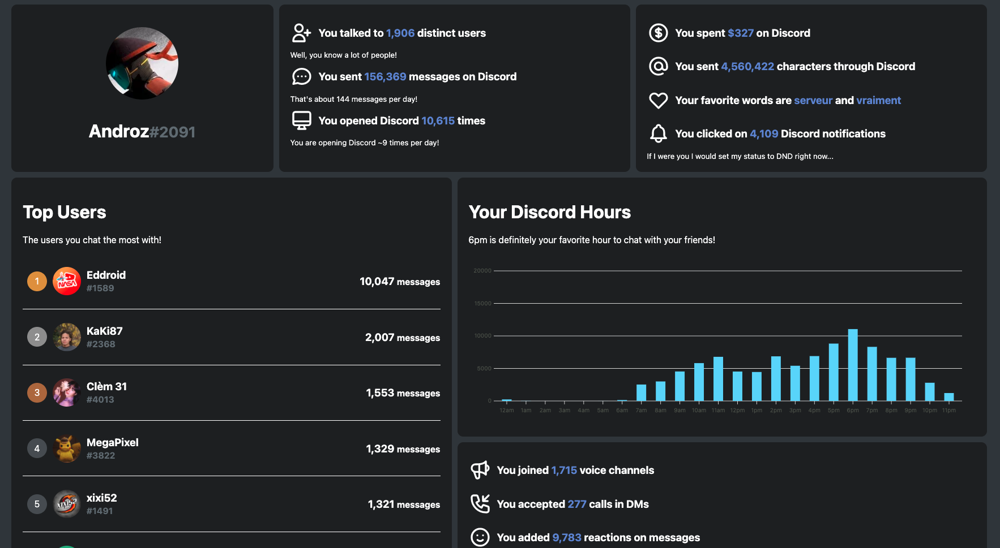

  

# [Discord Data Package Explorer](https://ddpe.androz2091.fr)

What's **really** in your Discord Data package? And how can this data be useful? Discord Data Package Explorer does the job for you!

## Example

### [DEMO](https://ddpe.androz2091.fr?demo)

## How to Use

* Ask for your data file in Discord (`Settings` > `Privacy & Safety`)
* Open **https://ddpe.androz2091.fr**
* and import your data file!

### Installation

Discord Data Package Explorer is built with **[Svelte](https://svelte.dev)**, and is quite easy to install.

* Clone the repository.
* Install the dependencies using `npm install` or `yarn install`.
* Start the app using `npm run dev` or `yarn dev`!

> Note: for testing purposes, you may append `?demo` to the URL to use the mocked data.
